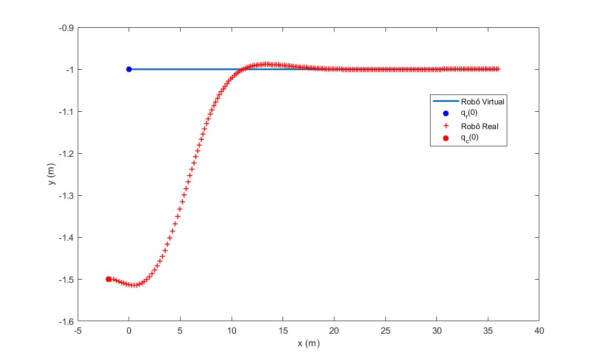
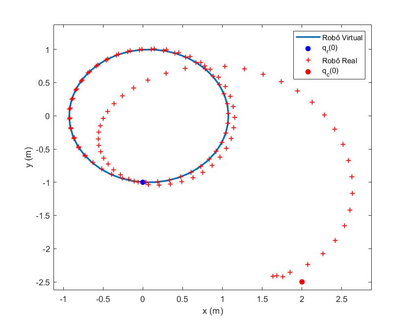

# Trajectory Tracking Control of a Input-Saturated Differential-Drive Mobile Robot via Sum of Squares Programming

Undergraduate thesis (TCC) — Electrical Engineering, Universidade Federal do Ceará (UFC), 2026.

**Author:** Victor Hugo Silva Maciel
**Advisor:** Prof. Dr.-Ing. Diego de Sousa Madeira
**Co-advisor:** Me. João Gabriel Napoleão Silva

## Overview

Differential-drive mobile robots are subject to physical velocity limits on their actuators, and ignoring this constraint at the controller-design stage can compromise closed-loop performance or even stability. This work develops a **state-feedback controller synthesis method for trajectory tracking that explicitly incorporates input saturation into the design**, using Sum of Squares (SOS) programming.

The kinematic tracking-error model, which is non-polynomial due to trigonometric terms, is rewritten as an input-affine polynomial system through a recasting technique. Actuator saturation, a non-smooth nonlinearity, is represented by a polytopic model that expresses it as a convex combination of linear behaviors at the vertices of a polytope. Building on the SOS-based synthesis method of Ichihara (2007), the Lyapunov stability conditions, the invariance of the resulting ellipsoidal set, and the validity of the polytopic saturation model are all translated into sufficient conditions verifiable by Sum of Squares, and consolidated into a single semidefinite programming (SDP) problem. Its solution provides, simultaneously, the Lyapunov function, the state-feedback gains, and an estimate of the region of attraction of the origin.

The controller is validated in simulation for two reference trajectories — a straight line and a circle — starting from different initial conditions. In both cases the tracking error converges asymptotically to zero, even while the actuators operate saturated during part of the transient.

## Method summary

**1. Kinematic error model.** Let $q_c = (x_c, y_c, \theta_c)$ be the real robot's posture and $q_r$ the virtual (reference) robot's posture. The postural error, expressed in the robot's own frame, is $e = (e_1, e_2, e_3)^\top = R(\theta_c)^\top (q_r - q_c)$, with dynamics

$$
\begin{cases}
\dot{e}_1 = \omega\, e_2 + v_r\cos e_3 - v_x\\
\dot{e}_2 = -\omega\, e_1 + v_r\sin e_3\\
\dot{e}_3 = \omega_r - \omega
\end{cases}
\qquad u = (v_x,\,\omega)^\top .
$$

(See the thesis for the full derivation, obtained by differentiating $e=R(\theta_c)^\top(q_r-q_c)$.)

**2. Polynomial recasting.** The terms $\cos e_3,\sin e_3$ are not polynomial. Introducing $e_4 = \sin e_3$, $e_5=\cos e_3$, subject to $G(e)=e_4^2+e_5^2-1=0$, the reduced state $e=(e_1,e_2,e_4,e_5)^\top\in\mathbb{R}^4$ obeys an **input-affine polynomial** model

$$
\dot e = A(e)\,e + B(e)\,\Phi(u).
$$

**3. Translation to equilibrium.** The physical equilibrium is $\bar e = (0,0,0,1)^\top$, not the origin. With $\tilde e = e-\bar e$, $\tilde u = u-\bar u$, the translated model $\dot{\tilde e} = f(\tilde e) + g(\tilde e)\,\Phi(\tilde u)$ satisfies $f(0)=0$, as required by Lyapunov's theorem.

**4. Saturation as a polytopic model.** The saturation function

$$
\Phi(u_i)=
\begin{cases}
\mathrm{sign}(u_i), & |u_i|>1\\
u_i, & |u_i|\le 1
\end{cases}
$$

is represented, in the region $\mathcal{L}(H(\tilde e)) = \{\,\tilde e : |h_j(\tilde e)\, Z(\tilde e)|\le 1,\; j=1,\dots,m\,\}$, as a convex combination between the unsaturated law $u(\tilde e) = F(\tilde e)Z(\tilde e)$ and an auxiliary control $\nu(\tilde e)=H(\tilde e)Z(\tilde e)$ that is guaranteed not to saturate, with weights at the $2^m$ vertices of $\Omega=[0,1]^m$.

**5. SOS synthesis (Theorem, after Ichihara 2007).** With Lyapunov candidate $V(\tilde e)=Z(\tilde e)^\top Q^{-1}Z(\tilde e)$, the search for $Q,\,K(\tilde e),\,T(\tilde e)$ (with $F=KQ^{-1}$, $H=TQ^{-1}$) is posed as a single SOS/SDP program with three families of matrix constraints:

$$
\mathcal{F}_1^{i}(\tilde e,\theta) - \varepsilon I = S_1^{i}(\tilde e),\qquad \forall\,\theta\in\mathrm{vert}\Omega
$$

$$
\begin{bmatrix} 1 & t_j(\tilde e)\\ t_j(\tilde e)^\top & \mathcal{F}_2^{j}(\tilde e)\end{bmatrix} = S_2^{j}(\tilde e)
$$

$$
Z(\tilde e)^\top\big(S_{\mathcal X}^{-1}-Q\big)Z(\tilde e) = s_3(\tilde e)
$$

which certify, respectively, $\dot V < 0$ at every vertex of the saturation polytope, the inclusion $\mathcal{E}(Q^{-1})\subseteq \mathcal{L}(H(\tilde e))$ (via Schur complement), and the inclusion $\mathcal{E}(Q^{-1})\subseteq\mathcal{X}$ — subject to $Q\succ 0$ and all multipliers being sums of squares. Feasibility certifies that $\mathcal{E}(Q^{-1})=\{\tilde e: V(\tilde e)\le 1\}$ is **positively invariant** and that the closed loop is asymptotically stable at $\tilde e = 0$.

**6. Optimization criterion.** $\mathrm{tr}(Q)$ is maximized, which enlarges $\mathcal{E}(Q^{-1})$. In both trajectories studied here, this pushes the constraint $S_{\mathcal X}\preceq Q^{-1}$ to equality, so the invariant ellipsoid ends up coinciding with the chosen analysis region $\mathcal X$.

### Example: straight-line trajectory

For $v_r=1.8$ m/s, $\omega_r=0$, $S_{\mathcal X}=13I$, $u_{\max}=(2.5,\,2.5)$, solving the SDP (14.6 s with MOSEK) yields the diagonal Lyapunov matrix

$$
V(\tilde e) = 13\,\tilde e_1^{2} + 13\,\tilde e_2^{2} + 13\,\tilde e_4^{2} + 13\,\tilde e_5^{2},
$$

and, e.g., the first component of the feedback gain,

$$
\begin{aligned}
u_1(\tilde e) ={}& 1.5474\times10^{-4}\,\tilde e_1^{2} - 5.5770\times10^{-5}\,\tilde e_1 \tilde e_2 + 2.2483\times10^{-4}\,\tilde e_1 \tilde e_4\\
&- 2.0498\times10^{-3}\,\tilde e_1 \tilde e_5 + 0.24748\,\tilde e_2^{2} + 1.1089\,\tilde e_2 \tilde e_4 + 2.4899\times10^{-4}\,\tilde e_2 \tilde e_5\\
&+ 3.3631\times10^{-3}\,\tilde e_4^{2} - 1.0121\times10^{-5}\,\tilde e_4 \tilde e_5 + 1.1989\times10^{-4}\,\tilde e_5^{2}\\
&+ 1.7402\,\tilde e_1 - 4.9726\times10^{-4}\,\tilde e_2 + 1.9584\times10^{-6}\,\tilde e_4 + 0.7066\,\tilde e_5.
\end{aligned}
$$

The remaining three components ($u_2,\nu_1,\nu_2$) for this trajectory, and all four for the circular one ($S_{\mathcal X}=4I$, with $v_r,\omega_r$ time-varying), follow the same quadratic-in-$\tilde e$ pattern and are computed directly inside the `.m` scripts (variables `u`, `v_u` after `sosgetsol`) — see `line_tracking.m` and `circle_tracking.m`.

## Repository structure

```
.
├── line_tracking.m     # SOS synthesis + simulation, straight-line trajectory
├── circle_tracking.m   # SOS synthesis + simulation, circular trajectory
├── images/
│   ├── reta_rastreamento.png
│   └── circulo_rastreamento.png
└── README.md
```

Each script:
- sets up and solves the SOS/SDP program (Theorem 3.5 of the thesis) for the corresponding reference trajectory;
- simulates the closed-loop tracking with saturated actuators;
- plots the 2D tracking, the control signals (`v_x`, `ω`), the error evolution, and a 3D phase portrait showing the invariant ellipsoid `E(Q⁻¹)`, the analysis region `X`, and the boundaries of the saturation-validity region `L(H(ẽ))`.

## Requirements

- MATLAB (tested with a recent release supporting `fimplicit3`)
- [SOSTOOLS](https://www.cds.caltech.edu/sostools/) (Sum of Squares programming toolbox)
- An SDP solver compatible with SOSTOOLS — the thesis results were obtained with [MOSEK](https://www.mosek.com/) (academic license), version 9.3.20
- Symbolic Math Toolbox

## Usage

```matlab
% Straight-line trajectory
line_tracking

% Circular trajectory
circle_tracking
```

Each script is self-contained: it runs the SOS synthesis, then the closed-loop simulation, then generates all plots.

## Results

For both trajectories, the postural tracking error converges asymptotically to zero (stabilization within ~6 s), even though both actuators operate saturated for a non-negligible interval at the start of the simulation. The 3D phase portraits confirm, geometrically, that once the error trajectory enters the invariant ellipsoid `E(Q⁻¹)`, it never leaves it — the practical signature of the contractive invariance guaranteed by the synthesis theorem.

**Straight-line trajectory** — real robot starting at `q_c(0) = (-2, -1.5, 0)`, tracking the virtual robot from `q_r(0) = (0, -1, 0)`:



**Circular trajectory** — real robot starting at `q_c(0) = (2, -2.5, -0.3)`, tracking the virtual robot from `q_r(0) = (0, -1, 0)`:



## Reference

This work extends:

> V. H. Maciel, D. de S. Madeira, W. B. Correia, "A sum of squares approach for trajectory tracking control of a differential drive mobile robot," in *Congresso Brasileiro de Automática (CBA)*, 2024.

and applies the synthesis method of:

> H. Ichihara, "State feedback synthesis for polynomial systems with input saturation using convex optimization," in *2007 American Control Conference*, pp. 2334–2339, 2007.

## License

No license file has been added yet. If you intend to reuse this code, please contact the author or open an issue.